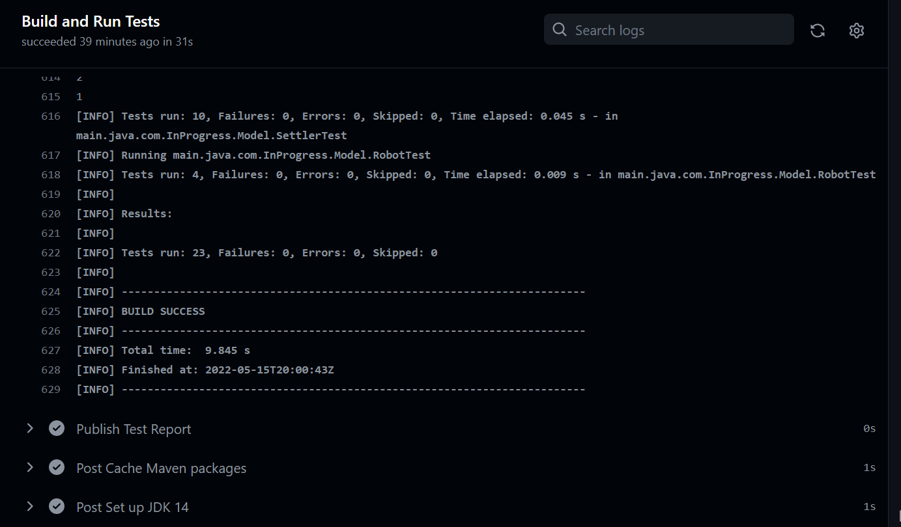
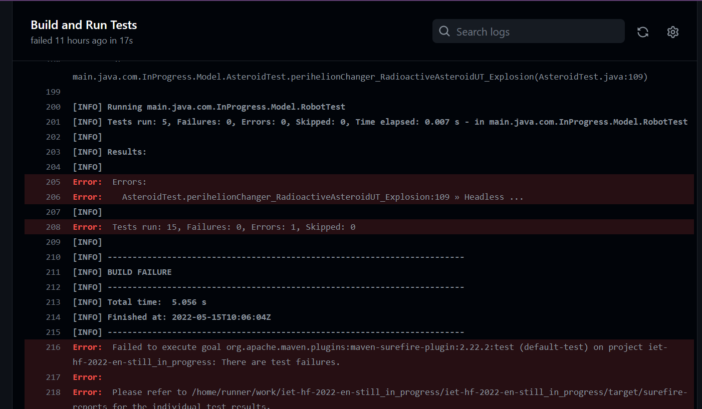

# Building Framework

To make our Project auomatically build and run the Junit tests we used [Maven](https://maven.apache.org/). Maven is a project management and comprehension tool that provides developers a complete build lifecycle framework. Maven is Based on the Project Object Model (POM).

## Description

We created a GitHub Action 'Build and Run Tests' by configuring the maven.yml file. The .yml file carries out a set of predefined instructions based on our project description.The instruction excuted by the GitHub Action are:-

1. We first set the checks to be executed after every Pull Request created to the Master branch.
2. We [checkout](https://github.com/actions/checkout) the code from the repository so that the worflow can access it.
3. Set up the JDK for building of the application . We use [Java version 16](https://openjdk.java.net/projects/jdk/16/) for the building our project.
4. Cache the maven dependencies so that we don't have to download all the dependencies at each check.
5. We run the Junit tests using the maven commads.

## Main Results

After the Tests have been run we will recieve either a Success message showing that none of the tests have failed.

or we could get an Error message with the details of what kind of error we encountered during the running of the check.

If we recieve even 1 failure in the Junit test the Check fails.

## Lessons learnt

-   A build framework, makes the job of any team easier by keeping track of all the dependencies used in the project.
- Prevents different team Members working on different versions of the tools used in the project.
- Make the job of integrating new features easier by running tests automatically, to demonstrate that the app is still in working condition.
- Helps in version control and Continuous Integration.
