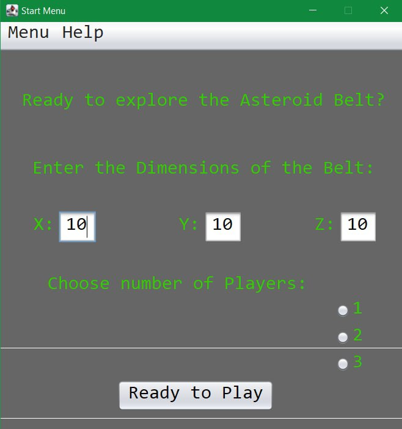
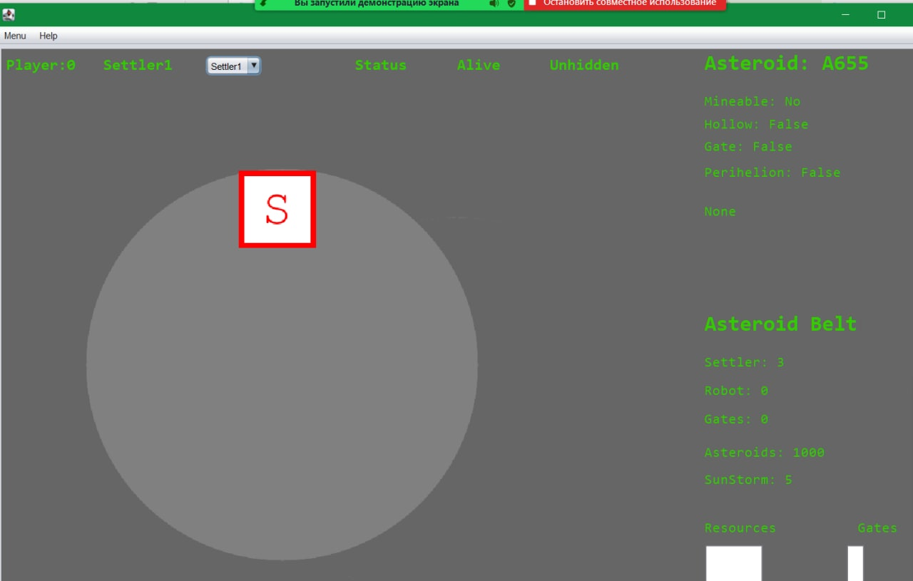
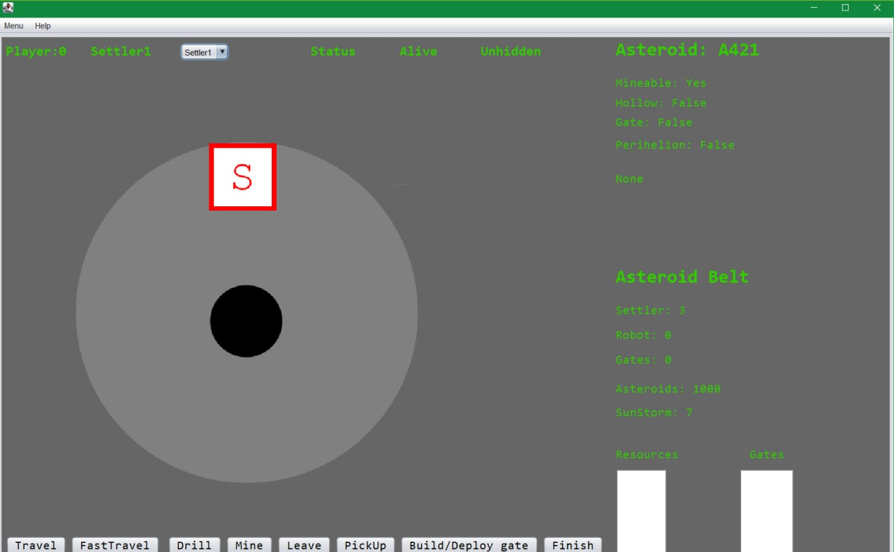
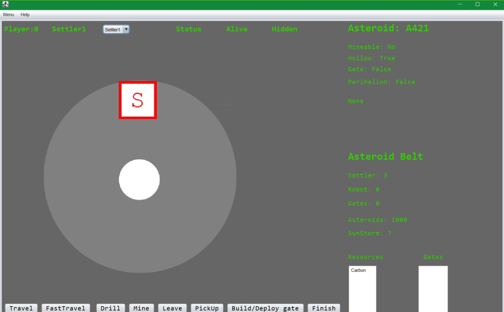
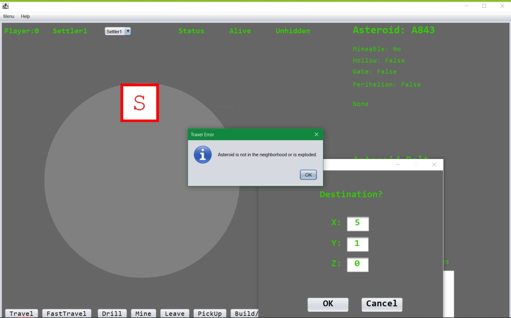
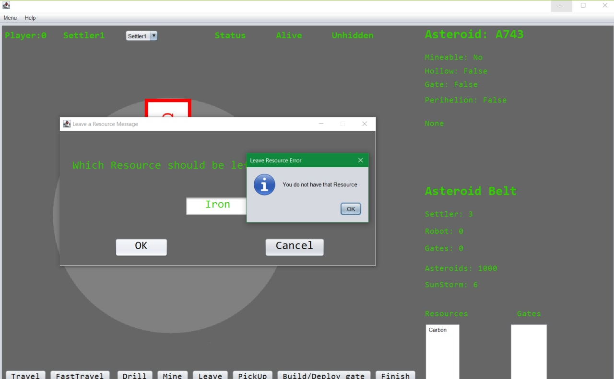
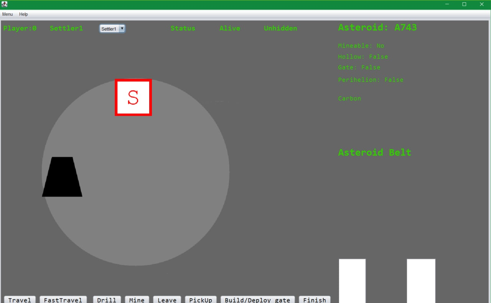
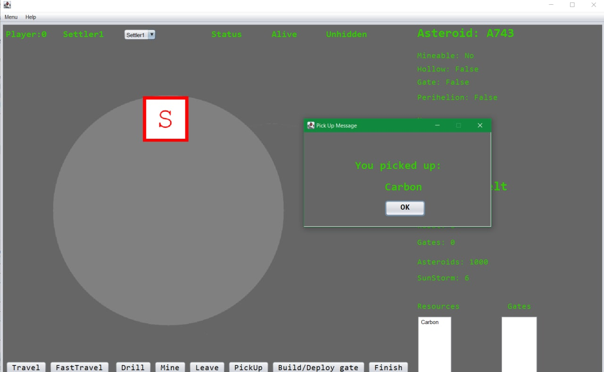
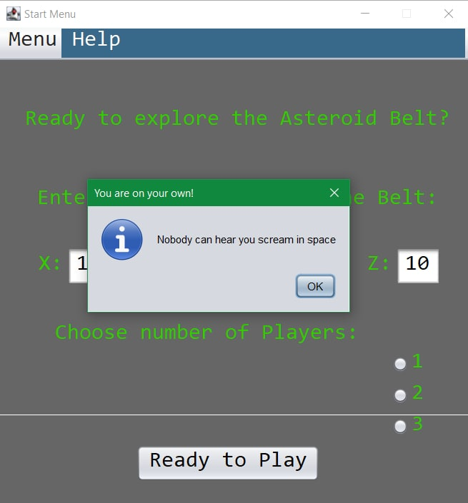
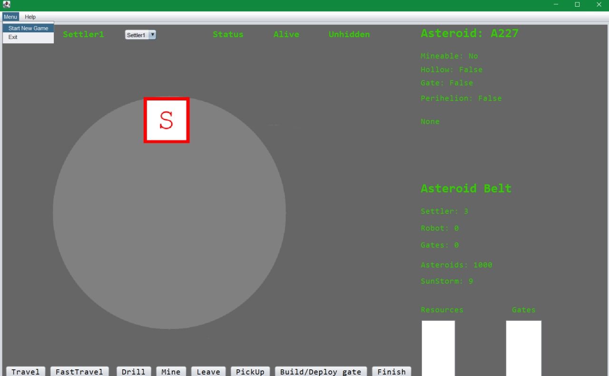

# Manual Tests

Main functionalit and so-called happy path of the game was tested manually with the following 10 test scenarios. All the tested have passed, but some bugs were found along the way.

## Description

h1. Game start

Objective: <initialize the game by setting up the field size and number of players>

h2. Instructions

|| Step No. || Step description || Expected result ||
| 1. | <run the project> | <game window pops up> |
| 2. | <select 1 player> | |
| 2. | <leave the default field size and click ready to play> | <the main game window is opened, asteroid appeared, asteroid info present > |
h2. Notes

Setup:

- 

Expected Result:

- 

h2. Result
pass

h1. Drill

Objective: <check that the resource with mantel bigger than 0 is drillable >

h2. Prerequisites

-Game start test

h2. Instructions

|| Step No. || Step description || Expected result ||
| 1. | <observe that the asteroid is not drilled through> | <there is nothing visible in the center of the asteroid> |
| 2. | <press drill till the resource appears> | <resource is visible in the center of asteroid> |
h2. Notes

Expected Result:

- 

h2. Result
pass

h1. Mine

Objective: <check that the drilled through asteroid is minable >

h2. Prerequisites

-Game start test
-Drill test

h2. Instructions

|| Step No. || Step description || Expected result ||
| 1. | <observe resource is visible> | <there is something in the middle of the asteroid> |
| 2. | <press mine button> | <resource is added to the resource list in the bottom right corner, hollow parameter is set to true and mined message pops up> |
h2. Notes

Expected Result:

- 

h2. Result
pass, but mined window pops up behind the main game window

h1. Travel fail

Objective: <check that player cannot travel to the asteroid not in the neighborhood>

h2. Prerequisites

-Game start test

h2. Instructions

|| Step No. || Step description || Expected result ||
| 1. | <press travel button> | <destination selection window pops up> |
| 2. | <enter coordinates where xyz coordinates differs with the current coordinate at least by 3> | <asteroid is not in the neighbourhood error pops up> |
h2. Notes

Expected Result:

- 

h2. Result
pass

h1. Travel success

Objective: <check that player can travel to the asteroid in the neighborhood >

h2. Prerequisites

-Game start test

h2. Instructions

|| Step No. || Step description || Expected result ||
| 1. | <press travel button> | <destination selection window pops up> |
| 2. | <enter coordinates where xyz coordinates differs with the current coordinate at least by 1> | <asteroid changes, asteroid coordinates in the top right corner match the entered ones> |

h2. Result
pass

h1. Change settler

Objective: <check that player can switch between settlers>

h2. Prerequisites

-Game start test

h2. Instructions

|| Step No. || Step description || Expected result ||
| 1. | <choose another settler in drop-down menu> | <settler badge and resource list updates accordingly> |
the entered ones> |

h2. Result
pass, but drop-down list selected value is not updated

h1. Leave resource fail

Objective: <check that the player cannot leave resource on the asteroid if they do not have it >

h2. Prerequisites

-Game start test
-Drill test
-Mine test

h2. Instructions

|| Step No. || Step description || Expected result ||
| 1. | <press leave> | <recource choice window pops up> |
| 1. | <choose resource that you dont have, press ok> | <you dont have resource window pops up> |
the entered ones> |
h2. Notes

Expected Result:

- 

h2. Result
pass

h1. Leave resource success

Objective: <check that the player can leave resource on the asteroid if they have it >

h2. Prerequisites

-Game start test
-Drill test
-Mine test

h2. Instructions

|| Step No. || Step description || Expected result ||
| 1. | <press leave> | <recource choice window pops up> |
| 1. | <choose resource that you have, press ok> | <observe resource placed on the asteroid> |

h2. Notes

Expected Result:

- 

h2. Result
pass

h1. Pick up

Objective: <check that the resource with mantel bigger than 0 is drillable >

h2. Prerequisites

-Game start test
-Drill test
-Mine test
-Leave resource success test

h2. Instructions

|| Step No. || Step description || Expected result ||
| 1. | <press pick up> | <pick up message pops up and resource is added to resource list> |

h2. Notes

Expected Result:

- 

h2. Result
pass

h1. Help

Objective: <check that help menu works>

h2. Instructions

|| Step No. || Step description || Expected result ||
| 1. | <press help on the top bar> | <you're alone in space message pops up> |

h2. Notes

Expected Result:

- 

h2. Result
pass

h1. New game

Objective: <check that the player can start a new game >

h2. Prerequisites

-Game start test

h2. Instructions

|| Step No. || Step description || Expected result ||
| 1. | <press menu - start new game > | <initialize game dialog pops up> |

h2. Notes

Setup:

- 

h2. Result
pass

## Lessons learnt

Manual tests allowed us to spot the issues not visible with automated tests and spot the unintuitive UI/UX.
