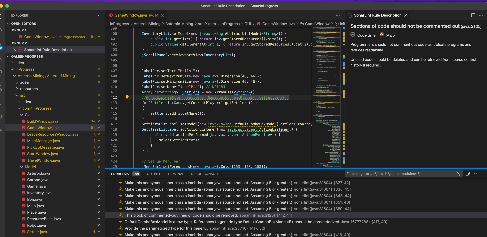

# Static Analysis

## Description

Static analysis allows to automatically analyze the program without actually running it. It checks the code against industry standards and errors. During this projects SonarLint and FindBugs extentions were chosen to perform the task.

## Main Results: SonarLint

After adding SonarLint to the project, 188 problems were found. Most of them, concerning the coding style (e.g. naming conventions, variables field hiding):
For some of the problems, issues were created and the problems were eliminated:

- commented out dead codes removed:

- 

- isEmpty() function used instead of comparision operator:

- 

## Main Results: FindBugs

After adding FindBugs to the project, 737 problems were found. Most of them regarding reliability aspect(e.g. magic numbers), but also some efficiency, maintainability (high cyclomatic complexity, visibility, redundant imports) and usability errors (naming conventions, variables field hiding):

For some of the problems, github issues were created and the problems were eliminated:

- variables and functions names were changed according to naming conventions:

- 

 fields were set to private and setters/getters added for access:

- 

- magic numbers removed and variables added instead:

- 

## Lessons learnt

Looking back at our last year project allowed us to see how much our development skills have improved since. The code was not well structured, which made it hard to maintain. A lot of functions had to be devided in smaller ones, to increase readibility of the code and to allow their reusing. And all of the numbers had to be turned into variables.
