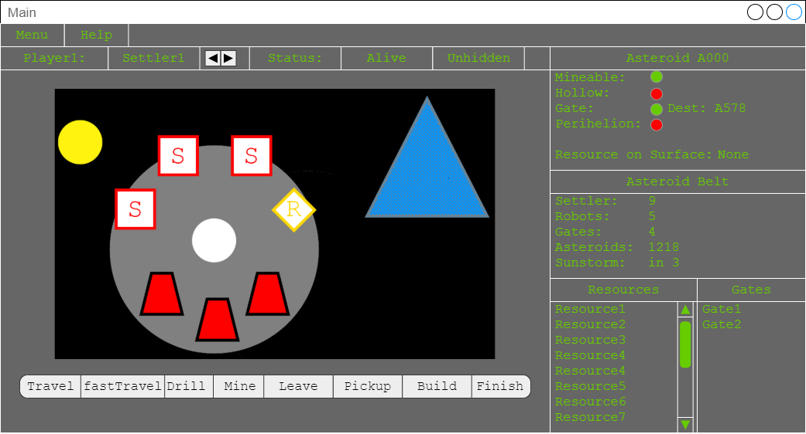
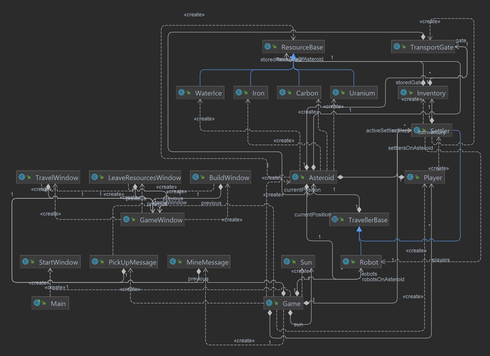

# Asteriod Mining
Asteroid Mining is a round-based, mulitplayer game with a graphical user interface in Java. The game was developed by us during our Software Lab course in the 3rd semester.

The repository of the original project can be found [here](https://github.com/LiubovRukhlina/InProgress).

## Goal of the Game
The goal of the game is to build a space station in the asteroid belt.  In order to achieve that players have to gather resources and cooperate. 
Each player controls up to 3 settlers which can travel between the asteroids in order to drill and mine them. Besides the settlers players can use autonomuous robots for support.

## Structure of the Project

The following images shows an overview over the project structure.

 

It consists of 2 packages

1. GUI with 7 classes
2. Model with 15 classes

The GUI follows the MVC design pattern of model, view and controller.

## Features we work on
For this assignment we are going to focus on 

 - static analysis of the original code base
 - adding a build framework, e. g. Maven
 - implementing  unit tests for the backend classes 

